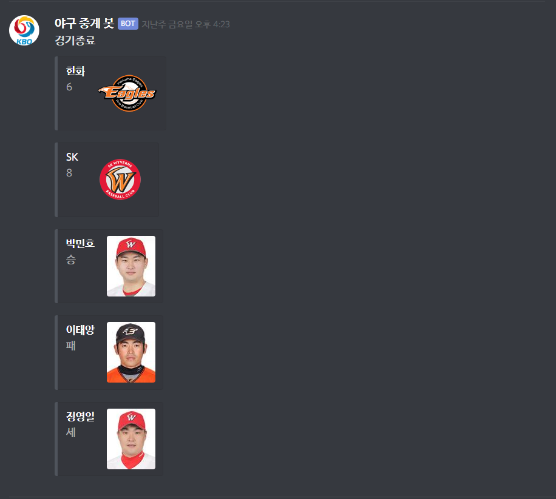

# 디스코드로 야구 문자 중계

## 설명
말 그대로 디스코드를 통해 야구 문자 중계를 볼 수 있습니다.

이닝 시작 혹은 경기 종료 시 점수를 보여 줍니다.

경기 종료시에는 점수와 더불어 투수 승패결과를 띄워줍니다.

## 스크린샷
사진이 작을 수 있습니다... 파일 올라와 있으니 그걸로 보셔도 됩니다.
<div>
  
  
</div>

## Getting Started / 어떻게 시작하나요?
다운 받고 선행 조건을 모두 다운 받거나 만들고 모듈 설치 후 자신의 봇 코드를 집어넣어 구동 한후 !야구를 입력 후 다음 스포츠에서 야구 문자 중계 페이지 주소를 입력하면 사용됩니다.

### Prerequisites / 선행 조건

아래 사항들이 설치가 되어있어야합니다.

```
python 3.5 이상 3.7 미만 버전 (저는 3.6대 버전을 이용했습니다.)

chrome

chromedriver(크롬 버전에 맞게)

자신의 디스코드 봇
```

### Installing / 설치

아래 사항들로 현 프로젝트에 관한 모듈들을 설치할 수 있습니다.

```
pip install discord == 0.16.12

pip install selenium

pip install bs4
```
## 추가될 점
가장 필요해 보이는 경기 일정  
선수 개인 스탯(타율, 방어율 등)  
링크가 아닌 그날 경기로 바로 이동  
더 필요한 사항이 있을시 [Issue](https://github.com/surplus-developer/baseballwatch-bot/issues)로 보내주시면 추가 생각해 보겠습니다.

## Deployment / 배포
클론 해서 다운 받아가시면 됩니다.

아니면 아래 [주소](https://discordapp.com/api/oauth2/authorize?client_id=611173967348236290&permissions=8&scope=bot)를 통해 봇을 추가하세요!

## Special / 감사의 말

* 크롤링도 안되는 네이버 스포츠를 대신해 사용할 다음 스포츠를 찾아낸 나에게 감사를 표합니다.
* 망할 뻔한 기아를 이끌어가셔서 제가 야구를 볼 이유를 만들어 주신 박흥식 감독대행님 감사합니다.
* 이걸 만들 수 있도록 계기를 준 우리 학교 GSM!!!의 교칙에 감사드립니다.
* 같이 보실 분들은 [초대 링크](https://discord.gg/dy6gWNq)를 통해 들어와 주세요!
